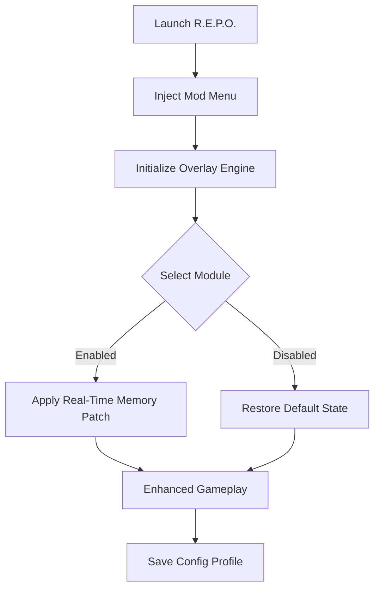

# ⚙️ R.E.P.O. Mod Menu Overview

The **R.E.P.O. Mod Menu** is a comprehensive real-time control interface built for players who want absolute authority over combat mechanics, resources, and world systems. Designed for precision and seamless integration, it blends an intuitive overlay with deep customization options — giving you developer-level access without compromising performance.

Whether you’re testing combat mechanics, optimizing loadouts, or pushing through high-difficulty missions, the R.E.P.O. Mod Menu lets you modify your gameplay instantly and safely.

---

## 🔩 Core Features

**💥 Combat Modules**

* *Infinite Ammo* – Sustain constant fire without reloading.
* *God Mode* – Immunity from all physical and elemental damage.
* *Rapid Fire* – Multiply weapon fire rates for experimental loadouts.
* *Instant Ability Recharge* – Reset cooldowns across all skills instantly.

**💰 Resource Tools**

* *Unlimited Credits* – Modify your economy balance in seconds.
* *Auto-Loot Collector* – Instantly gather drops, materials, and mission items.
* *Durability Lock* – Prevent weapon wear and armor degradation entirely.

**🌎 Environmental & Utility Mods**

* *Freeze AI Time* – Stop all enemy and NPC movement while retaining full player control.
* *Teleport System* – Jump to any saved location or waypoint.
* *Weather & Lighting Editor* – Customize environmental tone and mission atmosphere.
* *XP & Level Control* – Adjust experience gain or instantly max out your agent.

**🎮 Interface & Accessibility**

* Minimal overlay with smooth transitions (toggle: `Insert`).
* Real-time sliders for stats, speeds, and multipliers.
* Custom UI themes (default: *Rogue Silver*, *Neon Red*, *Blackout*).

---

## 🧩 Compatibility Matrix

| Platform      | Supported  | Notes                        |
| ------------- | ---------- | ---------------------------- |
| Windows 10/11 | ✅          | Full overlay compatibility   |
| Steam         | ✅          | Optimized for latest version |
| Epic Games    | ⚙️ Partial | Manual path setup required   |
| Gamepad Input | ✅          | D-Pad navigation supported   |

> [!NOTE]
> Always inject after entering the mission hub or main map to avoid desync with asset loading.

---

## 🚀 Setup & Activation

1. **Download** the `REPO_ModMenu.zip` file and extract its contents.
2. **Place** the folder in your main R.E.P.O. directory.
3. **Run** `REPOMenu_Loader.exe` as Administrator.
4. Wait for the status *“Overlay Initialized”*.
5. Launch the game and press `Insert` to toggle the menu.

Example configuration file:

```ini
[Player]
GodMode=True
InfiniteAmmo=True
RapidFire=3.0
AbilityRecharge=True

[Resources]
UnlimitedCredits=True
AutoLoot=True
DurabilityLock=True

[World]
FreezeAI=False
Weather=NightOps
TeleportKey=F7

[Hotkeys]
ToggleMenu=Insert
QuickHeal=F5
PanicDisable=F12
```

---

## 🧠 Mod Logic Flow



---

## 💻 Performance Profile

| Feature       | CPU Impact | GPU Load | Description             |
| ------------- | ---------- | -------- | ----------------------- |
| Infinite Ammo | <1%        | None     | Simple pointer patch    |
| Rapid Fire    | 2%         | Low      | Dependent on tick rate  |
| ESP Overlay   | 4%         | Moderate | Adjustable update speed |
| Auto-Loot     | 2%         | Minimal  | Passive range scanning  |

> [!IMPORTANT]
> Disable third-party overlays like MSI Afterburner, Rivatuner, or Discord overlay before running the Mod Menu for maximum stability.

---

## 🧩 Advanced Customization

**Dynamic Attribute Editor**
Adjust any player stat directly from the menu:

* Health, Shield, Speed, Jump Height, Melee Damage
* Weapon Accuracy and Projectile Spread

Example:

```ini
[Stats]
HealthMultiplier=2.5
SpeedMultiplier=1.8
JumpBoost=1.3
WeaponRecoil=0
```

**Environmental Control Example**

```ini
[World]
Weather=Foggy
Lighting=LowContrast
GravityScale=0.7
```

> [!TIP]
> Combine *Freeze AI* with *Rapid Fire* to simulate training scenarios or weapon balancing tests.

---

## ❓ FAQ

### ⚙️ 1. Is the R.E.P.O. Mod Menu safe to use?

Yes — it uses secure runtime hooks and never edits game files permanently.

### 🧩 2. Does it work online?

It is built for **offline and private sessions** only. Online usage is not supported.

### 🔁 3. How do I update it?

The loader auto-updates offsets and configurations when connected to the update server.

### 🎨 4. Can I change the theme?

Yes — edit the `UI_Theme.json` file to customize fonts, colors, and opacity.

### 💾 5. Can I share my configs?

Absolutely! Export your `.ini` profiles from `Documents\REPOMenu\Profiles\`.

---

## 🧬 Example Preset: “Tactical Ghost”

```ini
[Player]
GodMode=True
InfiniteAmmo=True
RapidFire=2.0
SpeedMultiplier=1.5

[World]
FreezeAI=True
Weather=NightOps
Lighting=Low
```

> [!WARNING]
> Avoid using FreezeAI during scripted sequences — it can interrupt objective triggers.

---

## 🏁 Final Thoughts

The **R.E.P.O. Mod Menu** merges professional-grade control with sleek design — built for testing, exploring, and dominating every mission on your own terms. With deep customization, instant toggles, and performance-aware engineering, it stands as the definitive toolkit for mastering the R.E.P.O. world.

Stable, powerful, and endlessly configurable — *you decide how the battlefield behaves.*

---

**R.E.P.O. Mod Menu** — command the field, control the systems, and rewrite your mission reality.
